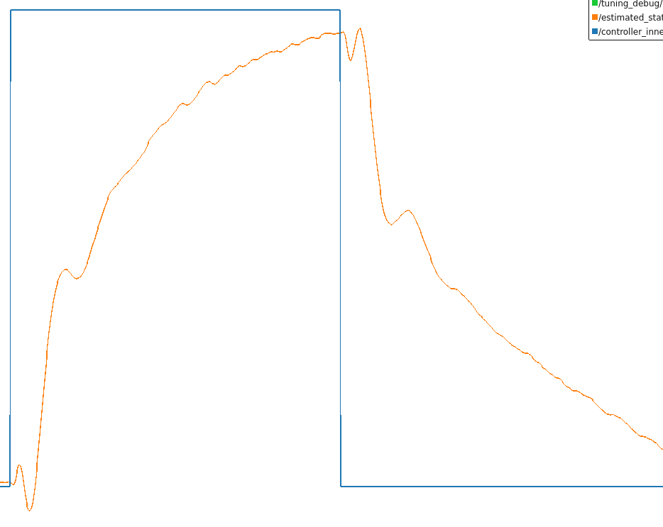

# ROSplane Tuning

This ROS2 package contains tools useful for tuning the autopilot performance of ROSplane.

We recommend using [PlotJuggler](https://github.com/facontidavide/PlotJuggler) to visualize command input and response.

## Autotuner

To make using ROSplane easier, we have implemented an autotune node. This node performs a gradient-based optimization routine where the autotune adjusts the autopilot gains in the direction that minimizes the error between the autopilot command and estimated state.

The optimization tests a series of gains using step commands from which error is calculated and gains are slowly adjusted to minimize the error. Error is calculated by giving a step input to an autopilot, waiting a few seconds for the system to respond, stepping back, waiting a few more seconds, and then calculuating the error. The autopilot then returns back to its previous state. This results in a responce like this figure:



### Usage

WARNING: Make sure to monitor the UAV during all portions of tuning, and be ready to take manual control in case the autopilot becomes unstable or does something terrible. We don't guarantee that the autotuner will not crash your plane.

1. Launch the launch file for the portion of the autopilot you want to tune. This will launch both ROSplane and the autotuner. Set the `continuous_tuning` parameter to `true` if you are confident in the autopilot's current ability to stay stable and in the air. Leave it as `false` if you'd rather manually begin each iteration.
    ```
    ros2 launch rosplane_tuning roll_autotune.launch.py continuous_tuning:=true
    ```

2. Launch ROSplane if you haven't already done so. The autotuner will start from whichever gains are currently set in ROSplane, so set those to whichever values you'd like to start the optimization from.
    ```
    ros2 launch rosplane_tuning rosplane_tuning.launch.py
    ```

3. Get ROSplane into the desired state, like an orbit high above the launch site. The autotuner will return to this state between every iteration.

4. Call the `run_tuning_iteration` service to start tuning.  If you set `continuous_tuning` to `false`, you will need to manually call the `run_tuning_iteration` service to start each iteration.

5. Wait until the autotuner reports that it has finished or you are satisfied with the current response. The autotuner will update the current gains with the best response it has found so far.

Repeat for each autopilot you wish to tune. We recommend tuning the autopilots in this order: roll, pitch, airspeed, altitude, course. The airspeed and altitude autopilots are closely coupled, so you may need to iterate between them to get the best performance.

Make sure to set the new gains as the default values for ROSplane in the `rosplane/params` directory. Gains are reported by the autotuner in this order:
- Roll: `r_kp`, `r_kd`
- Pitch: `p_kp`, `p_kd`
- Airspeed: `a_t_kp`, `a_t_ki`
- Altitude: `a_kp`, `a_ki`
- Course: `c_kp`, `c_ki`

## Signal Generator

Signal generator is a ROS2 node that will generate step inputs, square waves, sine waves, sawtooth waves, and triangle waves to be used as command input for ROSplane. It has support for roll, pitch, altitude, course, and airspeed command input.

This is useful for tuning autopilots as we can give a clear and repeatable command to any portion of the autopilot and observe its response to that input. We can then tune gains, re-issue the same commands, and observe whether performance improved or worsened.

Signal generator works by publishing autopilot commands on the ROS network on the `controller_commands` and `tuning_debug` topics. Each control output (roll, pitch, altitude, course, airspeed) has a default values that is set by a ROS parameter. The signal generator will then add the generated signal to one of the control outputs with a set magnitude and frequency.

### Signal Types
- Step: This is a non-continuous signal, where the generated signal will jump between the default value and the default+magnitude every time the `toggle_step_signal` service is called.
- Sine: This is a continuous signal that create a standard sine wave.
- Square: This is a continuous signal that creates a square type pattern.
- Triangle: This is a continuous signal that ramps up and down between the minimum and maximum value of the signal, creating a triangle like pattern.
- Sawtooth: This is a continuous signal (sometimes call a ramp signal) that creates a constantly increasing signal that resets to its minimum value once the maximum value is reached.


*By Omegatron - Own work, CC BY-SA 3.0, https://commons.wikimedia.org/w/index.php?curid=343520*

### Parameters
- `controller_output`: Specifies what controller to apply the generated signal to. All other controllers will be constant at their default values. Valid values are `roll`, `pitch`, `altitude`, `course`, and `airspeed`.
- `signal_type`: Specified what kind of signal to generate. Valid values are `step`, `square`, `sawtooth`, `triangle`, and `sine`.
- `publish_rate_hz`: Specifies the rate to publish control commands. Must be greater than 0.
- `signal_magnitude`: Specifies the magnitude of the signal to generate. The signal will only be added to the default value, rather than subtracted. For example, if the signal has a magnitude of 2 and a default value of 5, the generated signal will range from 5 to 7.
- `frequency_hz`: Specifies the frequency of the generated signal. Must be greater than 0, and does not apply to step signals. For step signals, manually toggle the signal up and down with the `toggle_step_signal` service.
- `default_va_c`: The default value for the commanded airspeed, in meters per second.
- `default_h_c`: The default value for the commanded altitude, in meters above takeoff altitude.
- `default_chi_c`: The default value for the commanded course, in radians clockwise from north.
- `default_theta_c`: The default value for the commanded pitch, in radians pitched up from horizontal.
- `default_phi_c`: The default value for the commanded roll, in radians 'rolled right' from horizontal.

To get a parameter from the command line, use this command, replacing <parameter> with the desired parameter to get.
```
ros2 param get signal_generator <parameter>
```

To set a parameter from the command line, use this command, replacing <parameter> with the name of the parameter to set. Enter number parameters as float values, not integers (i.e. 1.0, not 1).
```
ros2 param set signal_generator <parameter>
```

### ROS Services
- `toggle_step_signal`: Toggles the step signal up and down. Does not apply to any other type of signal.
- `reset_signal`: Stops the generated signal and sets it to its default value.
- `pause_signal`: Pauses the generated signal at its current value. Does not apply to step signal.
- `start_continuous_signal`: Starts the signal generator at its current value, running continously until manually stopped. Does not apply to step signal.
- `start_single_period_signal`: Starts the signal generator at its current value, stopping after one full cycle. Does not apply to step signal.

To call a service from the command line use this command, replacing <service> with the name of the service you wish to call.
```
ros2 service call <service> std_srvs/srv/Trigger
```

## Data Viz

Data viz is a python utility that can be used to plot the controller commands and response, as an alternative to PlotJuggler. To run data viz,
```
ros2 run rosplane_tuning data_viz.py
```
